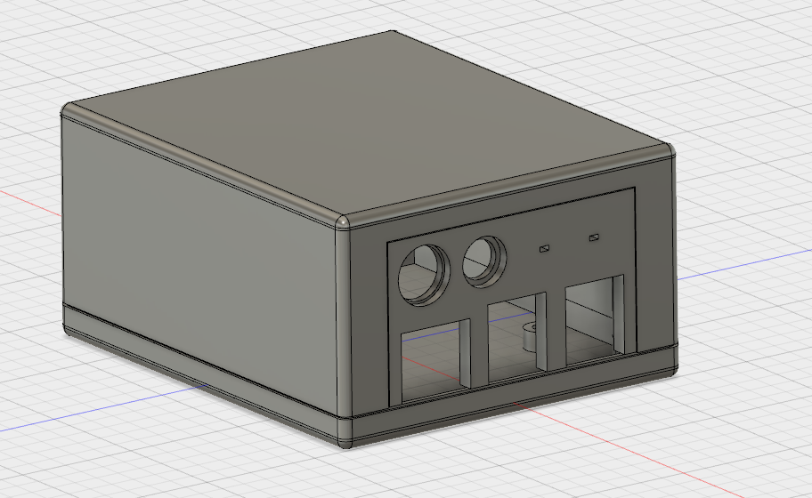

DemoCase for Raspberry pi B+ , 2B and 3B
=====================================================
This is a demonstration case of raspberry pie.

How to use
====
Use the insert nut to stop the screw.
Used to fix case and raspberry pi.

M:2.6mm
Pitch:0.45
D1:3.5mm
D2:3.8mm
L:3mm

It is used to fix the DC jack.
http://akizukidenshi.com/catalog/g/gC-06299/

Options
====
When using the terminal block please use the following.
https://www.sengoku.co.jp/mod/sgk_cart/detail.php?code=EEHD-47DS

To use the earphone jack, use the following.
http://akizukidenshi.com/catalog/g/gC-08335/

License
====
This software is released under the MIT License, see [LICENSE](https://github.com/ekazyam/Raspberry-Pi-Demo-Case/blob/master/LICENSE).
